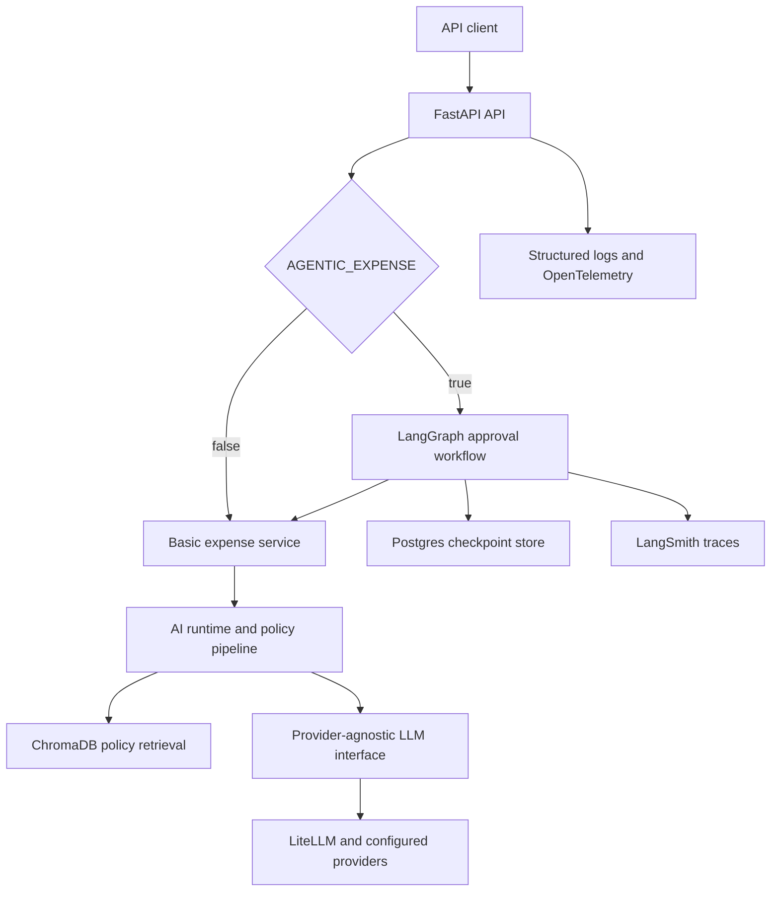
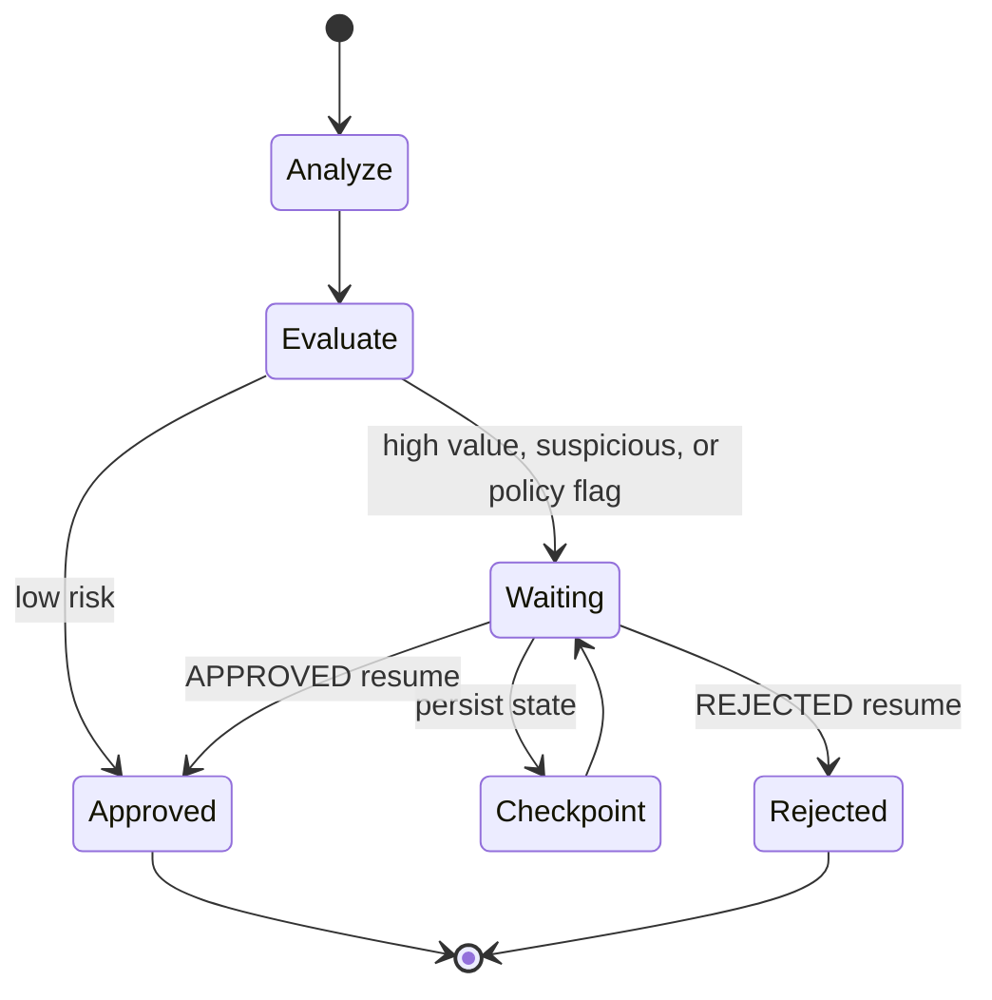

# Expense AI

An agentic AI expense-approval platform built with FastAPI, LiteLLM, ChromaDB, LangGraph, PostgreSQL, OpenTelemetry, and LangSmith.

Expense AI demonstrates how to move an LLM feature beyond a single provider call into a layered, observable, resilient application. It validates expense submissions, retrieves relevant policy context, produces structured analysis, and pauses high-risk requests for durable human approval.

## Project purpose

This project is a portfolio-ready reference architecture for production-oriented AI services. It focuses on:

- clean separation between API, domain, orchestration, retrieval, and provider infrastructure;
- provider-independent LLM access through LiteLLM;
- validated, structured Pydantic outputs instead of unstructured model text;
- RAG-based expense-policy checks with ChromaDB;
- a resumable LangGraph human-approval workflow;
- operational safeguards such as retries, timeouts, caching, circuit breaking, guardrails, and fallback;
- request-level observability through structured logs, OpenTelemetry, token usage, cost estimates, and LangSmith.

The project intentionally avoids unnecessary AI features. Its current priority is reliable demonstration and straightforward deployment.

## Architecture



The runtime applies the configured policies around each model call:

```text
observability -> provider selection -> retrieval -> prompt preparation
              -> guardrails -> cache -> retry -> circuit breaker -> timeout
```

## Module completion status

| Area | Status | Implemented capability |
| --- | --- | --- |
| API foundation | Complete | FastAPI routes, Pydantic v2 validation, centralized error handling |
| Architecture | Complete | Layered API, service, AI runtime, provider, RAG, and agent modules |
| LLM integration | Complete | Provider abstraction, LiteLLM implementation, provider fallback |
| Prompting | Complete | Modular templates, prompt registry, versioning, and examples |
| Structured output | Complete | Pydantic-based expense-analysis responses |
| Production policies | Complete | Retry, timeout, cache, circuit breaker, guardrails, and fallback |
| RAG | Complete | ChromaDB retrieval with deterministic policy-corpus seeding |
| Agentic workflow | Complete | LangGraph approval routing, interruption, and resume |
| Persistence | Complete | PostgreSQL-backed LangGraph checkpoints |
| Observability | Complete | Request IDs, JSON logs, OpenTelemetry traces and metrics, token/cost tracking |
| Deployment | Ready | Docker, Docker Compose, Procfile, Python 3.12, health check, configurable port |
| Cloud verification | Environment-specific | Verify provider, PostgreSQL, OpenTelemetry, and LangSmith credentials after deployment |

## Repository layout

```text
app/
├── agents/          # LangGraph approval workflow and checkpointing
├── ai/              # Runtime, pipeline, policies, and provider selection
├── llm/             # Provider-independent LLM interface and LiteLLM adapter
├── observability/   # Logging, tracing, metrics, redaction, and cost estimation
├── prompts/         # Prompt templates, registry, rendering, and versions
├── rag/             # Chroma retriever and static policy corpus
├── routers/         # Health and expense API routes
├── services/        # Expense application and domain services
├── config.py        # Pydantic settings and source precedence
├── main.py          # FastAPI application
└── schemas.py       # API and workflow models
```

## Configuration model

Configuration precedence is:

1. arguments passed directly to `Settings(...)`;
2. operating-system or container environment variables;
3. `.env` values;
4. `application.yaml`;
5. file secrets;
6. Pydantic model defaults.

Environment variables override YAML. Nested settings use a double underscore because `env_nested_delimiter="__"`:

```text
DATA__DATABASE_URL           -> data.database_url
DATA__DATABASE_SSLMODE       -> data.database_sslmode
RAG__PERSIST_DIRECTORY       -> rag.persist_directory
OBSERVABILITY__TRACING_ENABLED -> observability.tracing_enabled
```

Never commit `.env`, provider keys, database passwords, or complete production connection URLs.

## Environment variables

| Variable | Required | Default | Purpose |
| --- | --- | --- | --- |
| `PORT` | In deployment | `8000` | HTTP port used by Uvicorn |
| `AGENTIC_EXPENSE` | No | `true` | Selects agentic (`true`) or basic (`false`) service mode |
| `DATA__DATABASE_URL` | Agentic mode | None | PostgreSQL URL used by LangGraph checkpointing |
| `DATA__DATABASE_SSLMODE` | Agentic mode | `prefer` | Use `disable` for local Compose and `require` for hosted PostgreSQL |
| `POSTGRES_USER` | Docker Compose | None | Local PostgreSQL user |
| `POSTGRES_PASSWORD` | Docker Compose | None | Local PostgreSQL password |
| `POSTGRES_DB` | Docker Compose | None | Local PostgreSQL database |
| `POSTGRES_PORT` | No | `5432` | Host port published by Compose |
| `APP_PORT` | No | `8000` | Host port published for the API |
| `RAG__ENABLED` | No | `true` | Enables policy retrieval |
| `RAG__PERSIST_DIRECTORY` | No | `.chroma` | Chroma persistence directory |
| `RAG__TOP_K` | No | `3` | Maximum policy documents retrieved |
| `RUNTIME_TIMEOUT_SECONDS` | Recommended in deployment | Model setting | Flat deployment override for runtime timeout |
| `RUNTIME_MAX_RETRIES` | Recommended in deployment | Model setting | Flat deployment override for retry count |
| `OPENROUTER_API_KEY` | When OpenRouter is enabled | None | OpenRouter provider credential |
| `<PROVIDER>_API_KEY` | Provider-dependent | None | Credential resolved from the configured provider name |
| `OBSERVABILITY__TRACING_ENABLED` | No | `true` | Enables OpenTelemetry tracing |
| `OBSERVABILITY__METRICS_ENABLED` | No | `true` | Enables OpenTelemetry metrics |
| `OBSERVABILITY__CONSOLE_TRACE_EXPORTER_ENABLED` | No | `false` | Writes spans to application logs |
| `OBSERVABILITY__CONSOLE_METRIC_EXPORTER_ENABLED` | No | `false` | Writes metrics to application logs |
| `OTEL_CONSOLE_TRACE_ENABLED` | No | None | Flat deployment override for console span export |
| `LANGSMITH_TRACING` | No | `false` | Enables LangSmith tracing for supported LangChain/LangGraph operations |
| `LANGSMITH_API_KEY` | With LangSmith | None | LangSmith credential |
| `LANGSMITH_PROJECT` | No | `default` | LangSmith project used to group demo traces |
| `CONFIG_DEBUG` | No | `false` | Logs safe configuration-resolution details; never logs credentials |

`application.yaml` should contain non-secret defaults only. Keep `data.database_url` empty in tracked YAML and supply it through the environment.

## Local setup

### Prerequisites

- Python 3.12
- PostgreSQL 16 when using agentic mode
- an API key for at least one enabled provider, or the mock LLM implementation for isolated development

### Install and run

```bash
git clone <repository-url>
cd expense-ai

python -m venv .venv
source .venv/bin/activate
# Windows PowerShell: .venv\Scripts\Activate.ps1

python -m pip install --upgrade pip
pip install -r requirements.txt
```

Create `.env` from the example and add only local secrets:

```bash
cp .env.example .env
```

Run basic mode without PostgreSQL:

```bash
AGENTIC_EXPENSE=false uvicorn app.main:app --host 0.0.0.0 --port 8000
```

For agentic mode, start PostgreSQL and configure a local URL:

```dotenv
AGENTIC_EXPENSE=true
DATA__DATABASE_URL=postgresql://<user>:<password>@localhost:5432/<database>
DATA__DATABASE_SSLMODE=disable
```

Then run:

```bash
uvicorn app.main:app --host 0.0.0.0 --port 8000
```

Open the interactive API documentation at <http://localhost:8000/docs>.

## Docker Compose setup

Docker Compose is the simplest complete local environment. It runs the API and PostgreSQL, waits for an authenticated database health check, and persists both PostgreSQL and Chroma data in named volumes.

Create `.env`:

```dotenv
POSTGRES_USER=expense_ai
POSTGRES_PASSWORD=replace_with_a_local_password
POSTGRES_DB=expense_ai
POSTGRES_PORT=5432
APP_PORT=8000
AGENTIC_EXPENSE=true
OPENROUTER_API_KEY=replace_with_your_key
```

Build without cache when dependencies or the Dockerfile changed:

```bash
docker compose build --no-cache --pull app
docker compose up -d --force-recreate
```

Normal startup is shorter:

```bash
docker compose up --build -d
```

Verify the stack:

```bash
docker compose ps
curl http://localhost:8000/health
docker compose logs -f app
```

Verify that Compose overrides the YAML database host:

```bash
docker compose exec app python -c "from urllib.parse import urlparse; from app.config import settings; print(urlparse(settings.data.database_url or '').hostname); print(settings.data.database_sslmode)"
```

Expected output:

```text
postgres
disable
```

Inside the app container, `localhost` means the app container itself. The database hostname must be the Compose service name, `postgres`.

Stop and remove containers while retaining data:

```bash
docker compose down --remove-orphans
```

To remove the named database and Chroma volumes as well, use `docker compose down -v`. This permanently deletes local persisted data.

## Basic versus agentic modes

| Capability | Basic mode | Agentic mode |
| --- | --- | --- |
| Configuration | `AGENTIC_EXPENSE=false` | `AGENTIC_EXPENSE=true` |
| PostgreSQL required | No | Yes |
| Structured expense analysis | Yes | Yes |
| Chroma policy retrieval | Yes, when RAG is enabled | Yes, when RAG is enabled |
| Automatic low-risk completion | Yes | Yes |
| Human approval pause and resume | No | Yes |
| Durable workflow checkpoint | No | Yes |
| Approval endpoint | Returns `400` because workflow is disabled | Resumes a stored workflow |

Use basic mode for a lightweight API or provider demonstration. Use agentic mode to demonstrate the complete human-in-the-loop architecture.

## API examples

Set a base URL:

```bash
export API_URL=http://localhost:8000
```

### Health check

```bash
curl "$API_URL/health"
```

### Low-risk expense

This request should normally complete without manual approval:

```bash
curl -X POST "$API_URL/api/v1/expenses/analyze" \
  -H "Content-Type: application/json" \
  -H "X-Request-ID: demo-low-risk-001" \
  -d '{
    "submitted_by": "Portfolio Demo",
    "currency": "INR",
    "expenses": [
      {
        "description": "Local client travel",
        "amount": 850,
        "quantity": 1,
        "merchant": "City Cabs",
        "category": "Travel"
      }
    ]
  }'
```

### High-value expense requiring approval

An aggregate amount of `10000` or more routes the agentic workflow to human review:

```bash
curl -X POST "$API_URL/api/v1/expenses/analyze" \
  -H "Content-Type: application/json" \
  -H "X-Request-ID: demo-approval-001" \
  -d '{
    "submitted_by": "Portfolio Demo",
    "currency": "INR",
    "expenses": [
      {
        "description": "Conference hotel booking",
        "amount": 12500,
        "quantity": 1,
        "merchant": "Demo Hotel",
        "category": "Accommodation",
        "notes": "Receipt attached"
      }
    ]
  }'
```

The response contains an `analysis_id` and a status of `APPROVAL_REQUIRED`.

### Resume approval

Copy the `analysis_id` from the preceding response:

```bash
curl -X POST "$API_URL/api/v1/expenses/<analysis_id>/approve" \
  -H "Content-Type: application/json" \
  -H "X-Request-ID: demo-approval-resume-001" \
  -d '{
    "action": "APPROVED",
    "reason": "Manager verified the conference booking"
  }'
```

Valid actions are `APPROVED` and `REJECTED`.

### RAG policy-flag example

Use wording that matches the static policy corpus, such as a missing receipt or currency mismatch:

```bash
curl -X POST "$API_URL/api/v1/expenses/analyze" \
  -H "Content-Type: application/json" \
  -H "X-Request-ID: demo-rag-001" \
  -d '{
    "submitted_by": "Portfolio Demo",
    "currency": "INR",
    "expenses": [
      {
        "description": "Meal reimbursement with missing receipt",
        "amount": 3200,
        "merchant": "Airport Restaurant",
        "category": "Meals",
        "notes": "Receipt is missing"
      }
    ]
  }'
```

The exact flags depend on the configured model, but the logs should show `rag.policy_context.retrieved` with retrieved policy context.

## Approval resume flow



The first request creates a deterministic `analysis_id`, which is also used as the LangGraph `thread_id`. When review is required, LangGraph interrupts execution and stores the workflow state in PostgreSQL. The approval endpoint loads that checkpoint and resumes the same thread with a human decision.

Because checkpoints are durable, a later application instance can resume a pending approval as long as it connects to the same database and receives the same `analysis_id`.

## ChromaDB behavior

- The retriever uses a deterministic static expense-policy corpus.
- The corpus is seeded into the configured Chroma collection when the retriever initializes.
- Direct local runs default to `.chroma`.
- Docker Compose uses `/data/chroma`, backed by the `chroma_data` named volume.
- A typical single-dyno deployment should use `/tmp/chroma` and re-seed from the static corpus after each restart.

Heroku-style dyno filesystems are ephemeral. The demo therefore treats hosted Chroma as a rebuildable cache, not the system of record. This is intentionally simpler than introducing a managed vector service. A managed vector database is the natural future option if policies become dynamic or persistence becomes a product requirement.

## PostgreSQL checkpointing

PostgreSQL is required only in agentic mode. The LangGraph `PostgresSaver` persists interruption state so approval can resume across requests or process restarts.

The application:

- creates the connection pool lazily when the agentic service is selected;
- caches the pool and checkpointer for process reuse;
- initializes checkpoint tables once for the cached resource;
- fails clearly when agentic mode is enabled without a database URL.

Use SSL mode `disable` only for the local Compose network. Use `require` for a hosted PostgreSQL service unless the provider documents a stronger verification mode and certificate setup.

## OpenTelemetry and LangSmith demo

### Structured logs and request IDs

Every request can provide `X-Request-ID`. The same ID is returned in the response and included in structured application logs, which makes an API request easy to follow through the pipeline.

Expected application events include:

```text
expense.analysis.started
rag.policy_context.retrieved
runtime.retry
runtime.execution.completed
expense.analysis.completed
http.request.completed
```

`runtime.retry` appears only when an attempt fails and the retry policy executes.

### Console OpenTelemetry demo

Enable console exporters locally or in a demo deployment:

```dotenv
OBSERVABILITY__TRACING_ENABLED=true
OBSERVABILITY__METRICS_ENABLED=true
OBSERVABILITY__CONSOLE_TRACE_EXPORTER_ENABLED=true
OBSERVABILITY__CONSOLE_METRIC_EXPORTER_ENABLED=true
```

Then run an API example and inspect:

```bash
docker compose logs -f app
```

FastAPI instrumentation is enabled, and application spans include the HTTP request, expense service, agentic workflow, AI runtime, and provider call. Console export is suitable for a portfolio demo when no external OTLP collector is configured.

### LangSmith demo

Configure LangSmith without committing its key:

```dotenv
LANGSMITH_TRACING=true
LANGSMITH_API_KEY=replace_with_your_key
LANGSMITH_PROJECT=expense-ai-demo
```

Restart the application, submit a high-value request, and resume it. Use LangSmith to show the LangGraph execution and approval transition. Use OpenTelemetry and structured application logs to show the surrounding FastAPI, RAG, retry, token, cost, and provider-runtime activity.

LangSmith visibility depends on valid credentials, network access, and the installed LangChain/LangGraph tracing integration. Verify that a trace reaches the selected project before a live presentation.

## Testing

Run the deployment-critical suites individually:

```bash
pytest tests/test_chroma_retriever.py
pytest tests/test_structured_output.py
pytest tests/test_expense_approval_graph.py
pytest tests/test_observability.py
pytest tests/test_error_handling.py
```

Run the complete suite:

```bash
pytest
```

Useful deployment-configuration verification:

```bash
pytest tests/test_deployment_configuration.py
```

## Deployment instructions

### Recommended simple deployment shape

Use one web process and one managed PostgreSQL database:

- FastAPI runs as the web process;
- managed PostgreSQL stores LangGraph checkpoints;
- Chroma uses `/tmp/chroma` and re-seeds its static corpus at process startup;
- application logs go to the platform log stream;
- OpenTelemetry uses console export for the demo, or OTLP when a collector is available;
- LangSmith provides a hosted view of supported LangGraph traces.

Docker Compose is for local multi-service development. It is not required to run multiple containers on Heroku.

### Heroku example

The repository includes a Python 3.12 version file and this `Procfile` command:

```text
web: uvicorn app.main:app --host 0.0.0.0 --port $PORT
```

Create the app and PostgreSQL add-on:

```bash
heroku login
heroku create <expense-ai-app-name>
heroku addons:create heroku-postgresql:essential-0 -a <expense-ai-app-name>
```

Heroku supplies a flat `DATABASE_URL`. Before deployment, ensure the configuration adapter maps `DATABASE_URL` to `settings.data.database_url` and `DATABASE_SSLMODE` to `settings.data.database_sslmode`. Nested `DATA__DATABASE_URL` and `DATA__DATABASE_SSLMODE` remain the preferred local and Docker variables. Do not copy a managed database URL into tracked files.

Set non-secret runtime configuration:

```bash
heroku config:set \
  AGENTIC_EXPENSE=true \
  DATABASE_SSLMODE=require \
  RUNTIME_TIMEOUT_SECONDS=10 \
  RUNTIME_MAX_RETRIES=1 \
  RAG_PERSIST_DIRECTORY=/tmp/chroma \
  OTEL_CONSOLE_TRACE_ENABLED=true \
  LANGSMITH_TRACING=true \
  LANGSMITH_PROJECT=expense-ai-heroku-demo \
  -a <expense-ai-app-name>
```

Set secrets separately:

```bash
heroku config:set OPENROUTER_API_KEY=<key> -a <expense-ai-app-name>
heroku config:set LANGSMITH_API_KEY=<key> -a <expense-ai-app-name>
```

Deploy and verify:

```bash
git push heroku main
heroku ps:scale web=1 -a <expense-ai-app-name>
heroku open -a <expense-ai-app-name>
heroku logs --tail -a <expense-ai-app-name>
curl https://<expense-ai-app-name>.herokuapp.com/health
```

Use `RUNTIME_TIMEOUT_SECONDS=10` and `RUNTIME_MAX_RETRIES=1` for the demo so one failed provider attempt plus one retry normally remains below the platform request deadline.

If deploying the Docker image instead of the Python buildpack, the image already starts with:

```text
exec uvicorn app.main:app --host 0.0.0.0 --port ${PORT:-8000}
```

The shell wrapper is intentional because Docker's JSON-form command does not expand `${PORT}` by itself.

## Architecture decisions

| Decision | Reason |
| --- | --- |
| FastAPI plus Pydantic v2 | Fast API development with explicit validation and typed contracts |
| Provider-independent LLM interface | Keeps domain services independent from LiteLLM and specific vendors |
| LiteLLM adapter | Supports provider selection and fallback through one infrastructure boundary |
| Structured Pydantic output | Converts probabilistic model output into a validated application contract |
| Modular prompt registry | Supports reuse, testing, versioning, and controlled evolution |
| Policy pipeline | Makes resilience and governance behavior composable and testable |
| Chroma with static startup seeding | Keeps the demonstration self-contained and inexpensive |
| LangGraph interrupts | Models human approval as resumable workflow state rather than synchronous blocking |
| PostgreSQL checkpoints | Preserves pending approvals across requests and process restarts |
| Basic/agentic service switch | Allows operation without PostgreSQL while retaining the full demo mode |
| OpenTelemetry plus structured logs | Provides vendor-neutral visibility across HTTP and AI runtime boundaries |
| LangSmith alongside OpenTelemetry | Adds graph-focused demo traces without replacing general application telemetry |
| Short deployment timeout and one retry | Bounds provider latency under the platform request deadline |
| Ephemeral hosted Chroma | Avoids premature vector-infrastructure complexity for a static demo corpus |

## Demo checklist

1. Open `/docs` and call `/health`.
2. Submit the low-risk expense and show automatic approval.
3. Submit the high-value expense and capture its `analysis_id`.
4. Show `APPROVAL_REQUIRED` and the PostgreSQL checkpoint.
5. Resume the request with `APPROVED` or `REJECTED`.
6. Submit the missing-receipt example and show the RAG retrieval event.
7. Correlate the request ID across API response and JSON logs.
8. Show OpenTelemetry console spans and the corresponding LangSmith graph trace.
9. If demonstrating retry, temporarily use a controlled failing provider and explain that `runtime.retry` is emitted only on failure. Restore the normal provider immediately afterward.

## Resume and LinkedIn positioning

### Short resume bullet

Built a provider-agnostic agentic expense-approval platform with FastAPI, LiteLLM, Pydantic structured outputs, ChromaDB RAG, and LangGraph human-in-the-loop workflows backed by PostgreSQL checkpoints; added OpenTelemetry observability and production safeguards including retries, timeouts, caching, circuit breaking, guardrails, cost tracking, and provider fallback.

### Detailed project description

Designed and implemented a production-oriented AI architecture for expense analysis and approval. The FastAPI service uses a clean layered design and a provider-independent LLM interface implemented with LiteLLM, allowing model providers to change without modifying business logic. Expense results are returned as validated Pydantic structured outputs, while ChromaDB retrieves relevant policy context from a deterministic corpus. A LangGraph workflow automatically completes low-risk requests and pauses high-value, suspicious, or policy-flagged expenses for human review; PostgreSQL checkpointing allows those approvals to resume reliably across requests and application restarts. The runtime includes retry, timeout, cache, circuit breaker, guardrail, and provider-fallback policies, with request IDs, structured logs, token and cost estimates, OpenTelemetry traces and metrics, and LangSmith workflow visibility. The application supports both lightweight basic mode and fully agentic mode and is packaged for local Docker Compose development and simple cloud deployment.

### Suggested LinkedIn headline

Agentic AI Expense Approval Platform | FastAPI, LiteLLM, ChromaDB RAG, LangGraph, PostgreSQL, OpenTelemetry

## Scope boundaries and future options

The current version intentionally keeps deployment small. Potential later improvements include a managed vector database, an external OTLP collector, authentication and authorization, tenant isolation, database migrations, and background processing for workflows that may exceed synchronous request limits. These are operational extensions, not requirements for the current portfolio demonstration.
